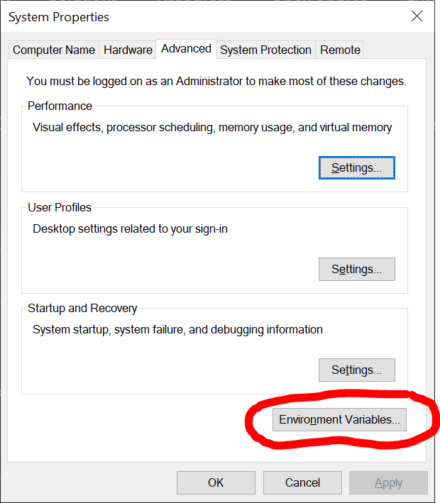
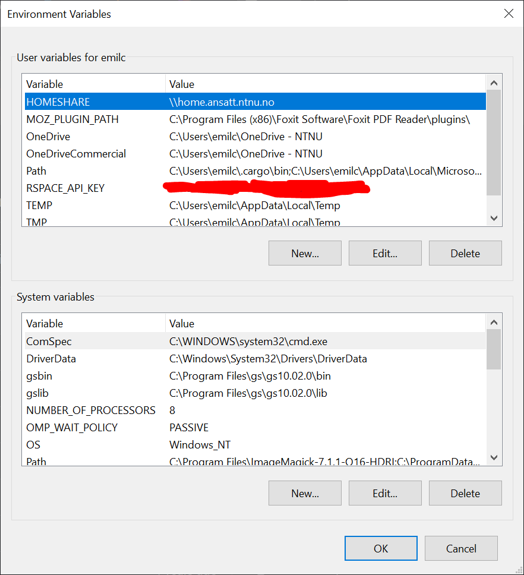
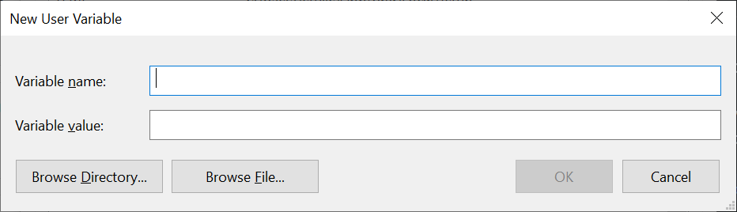

# RSpace-demos

Demos for various RSpace tasks.

## API tutorial

You can use the RSpace API through python to create, list, upload, and manage many aspects of your RSpace objects. However, some features can only be done through the RSpace user interface online.

Use of the API can be complicated if all you want to do is perform simple tasks. However, if you want to e.g. replicate the same task many times, or if you want to integrate RSpace into your analysis workflow by automatically upload any results/plots/documents etc, the API can help and improve your efficiency and robustness.

The Python API tools can be found on GitHub at [https://github.com/rspace-os/rspace-client-python](https://github.com/rspace-os/rspace-client-python). You should refer to the official github RSpace repository in the future, as the present notebook may run out of date.

You can also read more about the RSpace API at [https://rspace.ntnu.no/public/apiDocs](https://rspace.ntnu.no/public/apiDocs).

### Requirements

Use of the API through python depends on the `rspace_client==2.5.0` package found on both PyPi and conda. In addition, a few other requirements are useful. It is advised that a repository for RSpace API use includes at least these packages:

- rspace-client==2.5.0
- tabulate
- jupyter
- jupyterlab
- matplotlib
- numpy
- scipy
- markdown
- json2html
- pymdown-extensions
- seaborn
- pandas

### Preparations

In order to use the API through python, you will need to do some preparations first. Let us start by setting up a python environment.

#### Setting up environment

If you don't have a python installation already, you should start by considering the miniconda installer (https://www.anaconda.com/docs/getting-started/miniconda/main)[https://www.anaconda.com/docs/getting-started/miniconda/main]. Once you have installed any flavour of `conda`, you should be able to create a _virtual environment_ in which to install the package requirements needed to run the scripts/code in this repository.

Create a new environment for a _pure_ RSpace through conda (if you are not familiar with the terminal, please (create an issue)[https://github.com/emichr/RSpace-demos/issues/new/choose]):

```bash
conda create -n RSpace pip
conda activate RSpace
pip install rspace_client==2.5.0
```

This environment will give you what you need to interact with RSpace through Python. If you already have an envionment that you want to install the rspace client into as well, you should be able to do so easily. In the following example, change `<your_environment>` with the name of the environment you want to install the rspace client into.

```bash
conda activate <your_environment>
pip install rspace_client==2.5.0
```

You may need to install pip into your environment as well unless it has not already been installed.

Through experience, there are a number of other useful packages that you may want to have in addition to rspace in your environment. To install these packages, download the requirements.txt file and run (you will need to change the current working directory of your terminal to where you downloaded the `requirements.txt` file first):

```bash
conda activate <your_environment>
pip install -r requirements.txt
```

#### API Key

Next, you need to get your API key from RSpace. Your API key is _equivalent_ to a password, and should be treated as a secret. A few key points to remember is:

- __NEVER__ share your API key
- __NEVER__ include your API key directly in scripts or notebooks
- Be __CAREFUL__ if you enter your API key as input to scripts through the command-console. It will be stored in readable clear text in the console log!

We will get back to how to use your API key in a _more_ secure way later on.

##### Getting your API Key

To get your API key:

1. Log in to RSPace at [https://rspace.ntnu.no](https://rspace.ntnu.no)
2. Go to "My RSpace"
3. Go to "My Profile"
4. Scroll to the bottom and click "Generate API key"
5. Save the API key in a secure way. It will not be displayed again! Anyone with access to the API key will have full control of your RSpace.

If your API key for some reason gets compromised, or if you lose it, you can always repeat the steps above to regenerate the key. This will render any previous API key invalid. You can also revoke the key if you want to disable API access altogether.

##### Adding your key to the system environmental variables

To use your API key in scripts or on notebooks without adding it as clear text to files or in the command line, you can instead add the API key to the system environmental variables. This allows you to get the API key through python with commands such as

```python
import os
os.getenv("RSPACE_API_KEY")
```

How to add your API key to the system environmental variables varies from system to system.

###### Windows

On Windows, you can add your API key to the system environmental variables by (see example images after the list):

1. Search for "environment" in the start menu (you should get a hit for "Edit the system environment variables").
2. Under "User variables for ..." click "New".
3. Enter a suitable variable name (e.g. "RSPACE_API_KEY") and enter the API key you got from RSpace as the value.

  
  
  
  
  

###### Linux

In linux you can add your RSpace API key to the system environment variables by editing your bashrc file (note that this involves storing the key in an unsecured text file and poses a potential security risk).

Open bashrc in a text editor and add `export RSPACE_API_KEY=key` anywhere in the file. You can e.g. open the bashrc file with nano by running this command:

```bash
nano ~/.bashrc
```

### Using the API

You should now be able to use the code examples in this repository. Use of the API is relatively straight forward, and you can usually find good examples and demos at [https://github.com/rspace-os/rspace-client-python/tree/master/examples](https://github.com/rspace-os/rspace-client-python/tree/master/examples).

Most of the API commands returns a dictionary with the response from the RSpace server. To make your code more readable, you should try to separate it into smaller functions and write docstrings that explains your code - you will not remember the details a few weeks from now. Please feel free to use the demos in this repository as inspiration to create your own code.
